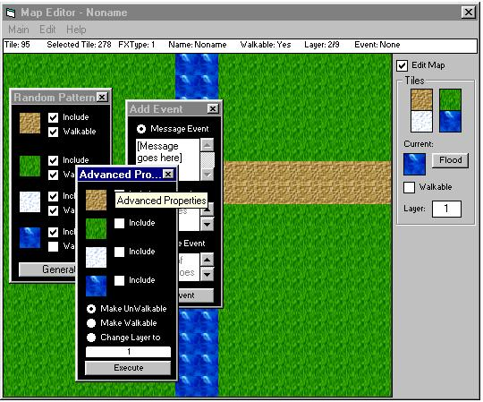



## Good Map Editor \(version 2\.0\)

### Description

Okey! In this version i have 1 single picturebox for all of it, and it now uses bitblt, also, a grid has been added to help =) Please leave comments and vote (hope you like it now, Hazen! =) )
 
### More Info
 

             |
---                |---
**Submitted On**   |2002-05-10 16:12:14
**By**             |[ReXz](https://github.com/Planet-Source-Code/PSCIndex/blob/master/ByAuthor/rexz.md)
**Level**          |Intermediate
**User Rating**    |5.0 (10 globes from 2 users)
**Compatibility**  |VB 6\.0
**Category**       |[Games](https://github.com/Planet-Source-Code/PSCIndex/blob/master/ByCategory/games__1-38.md)
**World**          |[Visual Basic](https://github.com/Planet-Source-Code/PSCIndex/blob/master/ByWorld/visual-basic.md)
**Archive File**   |[Good\_Map\_E816055102002\.zip](https://github.com/Planet-Source-Code/rexz-good-map-editor-version-2-0__1-34638/archive/master.zip)

